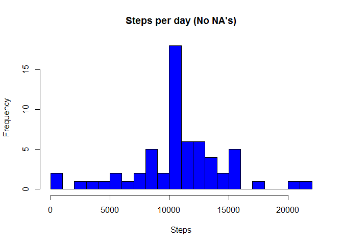

# PA1_TEMPLATE
Diego Tangassi  
16 de junio de 2016  

### Loading and preprocessing the data

This section reads the data needed from the CSV called "activity.csv".


```r
info <- read.csv("activity.csv",header=TRUE)
```

### What is mean total number of steps taken per day?

This section calculates the mean and the median of the steps taken per day, and make a histogram of the 
total number of steps taken each day.


```r
steps <- aggregate(steps ~ date, data=info, sum, na.rm = TRUE)
hist(steps[,2],breaks = 20,main = "Steps per day",xlab="Steps",col="blue")
```

<!-- -->

```r
mean_steps <- mean(steps$steps, na.rm = TRUE)
median_steps <- median(steps$steps, na.rm = TRUE)
mean_steps
```

```
## [1] 10766.19
```

```r
median_steps
```

```
## [1] 10765
```

### What is the average daily activity pattern? 

This section makes a time series plot of the 5-minute interval and the average number of steps taken averaged across all days.


```r
steps_mean <- aggregate(steps~interval,info,mean, na.rm=TRUE)
plot(steps_mean$interval,steps_mean$steps,type="l",xlab = "Interval",
     ylab = "Steps",main = "Average Steps per 5 Minutes Interval")
```

<!-- -->

Which 5-minute interval, on average across all the days in the dataset, contains the maximum number of steps?


```r
steps_mean[which.max(steps_mean$steps),]
```

```
##     interval    steps
## 104      835 206.1698
```

### Imputing missing values

This section calculates the total number of missing values in the dataset (i.e. the total number of rows with NAs)


```r
sum(is.na(info[,1]))
```

```
## [1] 2304
```

This section devise a strategy for filling in all of the missing values in the dataset while using the
5-minute interval mean and creates a new dataset that is equal to the original dataset but with the missing data filled in
 

```r
fullinfo <- info
nas <- is.na(fullinfo$steps)
intmean <- tapply(fullinfo$steps, fullinfo$interval, mean, na.rm=TRUE)
fullinfo$steps[nas] <- intmean[as.character(fullinfo$interval[nas])]
```
 
 
This section makes a histogram of the total number of steps taken each day and calculates the mean and median total number of steps taken per day
 


```r
stepsfull <- aggregate(steps ~ date, data=fullinfo, sum, na.rm = TRUE)
hist(stepsfull[,2],breaks = 20,main = "Steps per day (No NA's)",xlab="Steps",col="blue")
```

<!-- -->

```r
mean_stepsfull <- mean(stepsfull$steps, na.rm = TRUE)
median_stepsfull <- median(stepsfull$steps, na.rm = TRUE)
mean_stepsfull
```

```
## [1] 10766.19
```

```r
median_stepsfull
```

```
## [1] 10766.19
```


### Are there differences in activity patterns between weekdays and weekends?

This section creates a new factor variable in the dataset with two levels - "weekday" and "weekend" indicating whether a given date is a weekday or weekend day and makes a panel plot containing a time series plot of the 5-minute interval and the average number of steps taken, averaged across all weekday days or weekend days.


```r
fullinfo$date <- as.Date(fullinfo$date)
fullinfo$weekdays <- weekdays(fullinfo$date)
fullinfo$weekdays <- as.factor(ifelse(fullinfo$weekdays == "sábado" | 
                                      fullinfo$weekdays == "domingo", "weekend", "weekday"))
weekdayinfo <- aggregate(steps~interval+weekdays,fullinfo,mean)
par(mfrow=c(2,1),mar=c(2,2,2,2))
with(subset(weekdayinfo,weekdays=="weekday"),plot(interval,steps,type="l",main="Weekdays"))
with(subset(weekdayinfo,weekdays=="weekend"),plot(interval,steps,type="l",main="Weekend"))
```

<!-- -->

